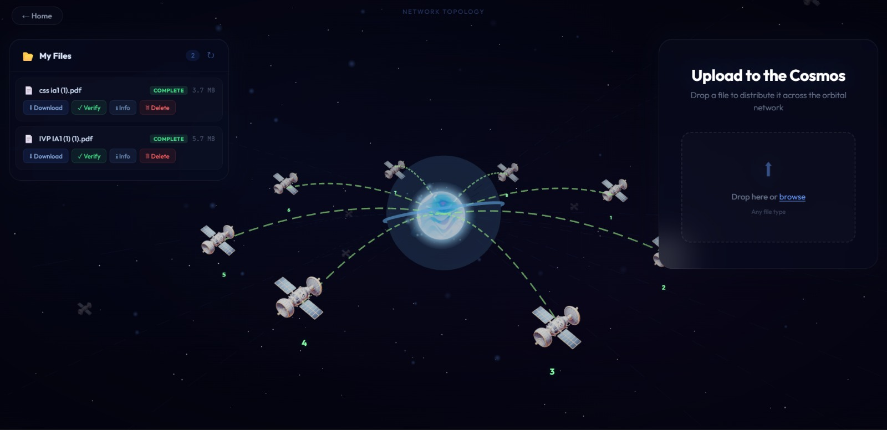
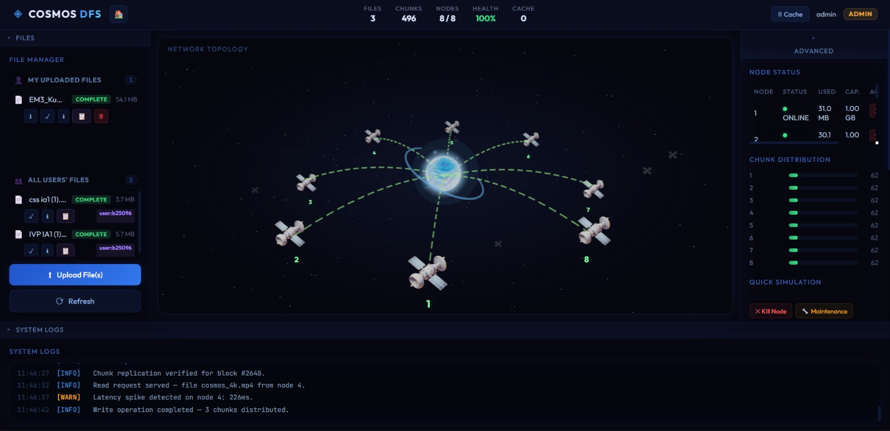
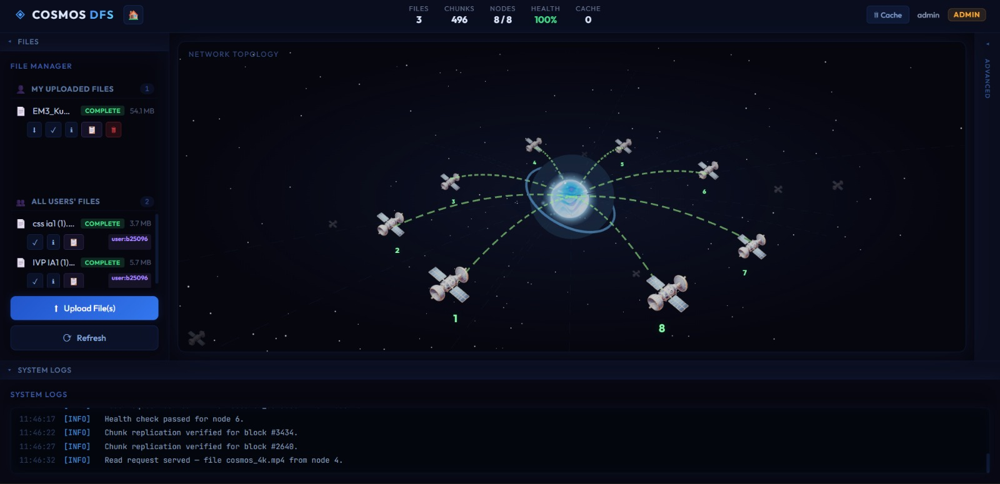

# 🛰️ COSMOS DFS — Fault-Tolerant Distributed File System

COSMOS DFS is a **metadata-driven distributed storage system** inspired by  
**Google File System (GFS)** and **Hadoop Distributed File System (HDFS)**.  
It simulates **orbital satellite nodes** where files are chunked, replicated, and automatically recovered during failures.

---

# 📸 User Interface

## 🌌 Landing Page

**Overview**
- Space-themed UI with orbital network visualization  
- Direct access to file upload and profile  
- Role-based access (User/Admin)

---

## 👤 User Dashboard

**Features**
- Upload files to distributed network  
- View personal file list  
- Download, verify, and delete files  
- Real-time network topology visualization  
- Chunk distribution across satellite nodes  

**Capabilities**
- Integrity verification (SHA-256)  
- Parallel download from replicas  
- Version-aware file management  

---

# 🛠️ Admin Interface

## 🛰️ Admin Control Panel

**Overview**
- Global file manager (all users)  
- Node health monitoring  
- Chunk distribution metrics  
- System logs and telemetry  

---

## ⚙️ Node Management & Simulation

**Admin Capabilities**
- Kill node (simulate failure)  
- Maintenance mode (read-only node)  
- View node capacity and usage  
- Monitor replication status  
- Observe automatic self-healing  

**Observability**
- Files, chunks, nodes, cache metrics  
- Health percentage indicator  
- Real-time system logs  

---

# 🧱 System Architecture

## Master–Worker Model

### Master (FastAPI + SQLite)
- Metadata Manager (files, chunks, node states)  
- Chunker & Distributor  
- Parallel Reconstructor  
- Self-healing Rebalancer  
- Heartbeat Monitor  
- Integrity Scheduler  

### Storage Nodes (Simulated Satellites)
- Chunk persistence  
- Replica storage  
- Capacity tracking  
- Latency simulation  

> Master stores metadata only; nodes store data blocks.

---

# ⚙️ Backend Stack
- **FastAPI** — REST API  
- **SQLite + SQLAlchemy** — Metadata store  
- **ThreadPoolExecutor** — Parallel chunk fetching  
- **hashlib (SHA-256)** — Integrity verification  
- **zlib** — Compression before chunking  
- **Custom LRU Cache** — Hot chunk reads  

---

# 🔄 Core Pipelines

## 📤 Upload Pipeline
1. File received via API  
2. Full-file SHA-256 computed  
3. Optional zlib compression  
4. Split into 512 KB chunks  
5. Per-chunk SHA-256 generated  
6. Node selection (round-robin or least-loaded)  
7. Primary + replica assignment (RF = 2)  
8. Chunks written to nodes  
9. Metadata committed atomically  

**Outcome**
- Versioned file record  
- Chunk → node mapping  
- Updated node utilization  

---

## 📥 Download Pipeline
1. Query metadata for ordered chunk list  
2. Parallel chunk retrieval  
3. Read policy → LRU cache → Primary → Replica  
4. SHA-256 validation per chunk  
5. Ordered reassembly  
6. Decompression (if enabled)  
7. Integrity-verified file returned  

---

# 🧠 Fault Tolerance Workflow

## Failure Detection
- Heartbeat monitor  
- Node states: `ONLINE → DEGRADED → OFFLINE`

## Self-Healing Rebalancer
- Identify chunks on failed node  
- Promote replica → new primary  
- Re-replicate to healthy node  
- Update metadata atomically  

**Result**
- Replication factor maintained  
- Zero manual intervention  
- Continuous availability  

---

# 🛡️ Data Integrity & Reliability
- SHA-256 per chunk + full file checksum  
- Scheduled integrity verification  
- File status auto-updated (COMPLETE → DEGRADED)  
- Metadata as single source of truth  
- Versioned uploads  

---

# 👤 User Workflow
1. Upload file to distributed network  
2. File chunked and replicated across nodes  
3. View file status and chunk distribution  
4. Download with replica fallback  
5. Verify integrity on demand  

---

# 🛠️ Admin Workflow
1. Monitor global file and node health  
2. Simulate node failure (Kill Node)  
3. Observe automatic replica promotion  
4. Trigger maintenance mode  
5. Review system logs and replication metrics  

---

# 📊 Observability & Metrics
- Node health and utilization  
- Chunk distribution per node  
- Cache usage statistics  
- File–chunk mapping endpoints  
- System health API  

---

# ✨ Implemented Features
- Replication with failover (RF = 2)  
- Least-loaded distribution strategy  
- Compression before chunking  
- Parallel reconstruction  
- LRU chunk caching  
- Heartbeat monitoring  
- Scheduled integrity verification  
- Maintenance mode  
- Versioned file storage  

---

# 🚀 Planned Enhancements
- Chaos mode (multi-node failure simulation)  
- Real-time dashboard (SSE/WebSocket)  
- Benchmark metrics and latency graphs  
- Audit logging  

---

# 🧪 Demo Scenario
1. Upload file → observe chunk distribution  
2. Kill a node → system marks OFFLINE  
3. Download same file → served from replica  
4. Rebalancer restores replication  

---

# 📌 Project Status
✅ End-to-end distributed storage simulation  
✅ Automatic fault recovery  
✅ Integrity-verified parallel reconstruction  
🚧 Real multi-machine deployment (future)

---

# 📄 License
MIT License
